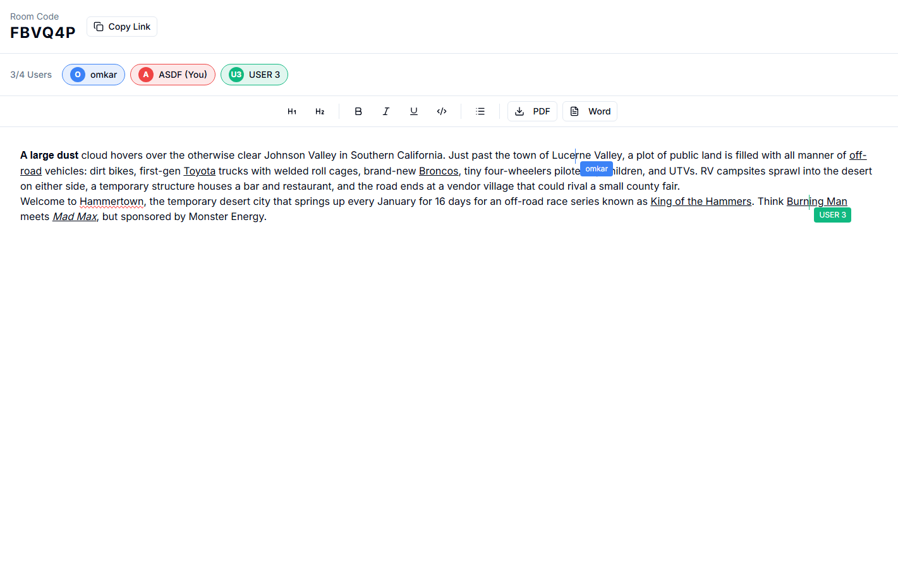

# Sync Scribe

Sync Scribe is a project I built to make real-time collaborative writing feel simple, using Next.js and a WebSocket server. 

## Live demo

Currently live at -  [syncscribe.curr.xyz](https://syncscribe.curr.xyz)

## Features

- Real-time collaborative editing in shared rooms
- Presence-aware collaboration with multiple users
- Rich text editing with formatting controls
- Document export support (PDF/DOCX)

## Tech stack

- Next.js 16 (App Router) + React 19
- TypeScript + Tailwind CSS
- Node.js WebSocket server (`ws`)
- Zustand for client-side state
- TipTap editor for rich text editings

## Preview



## Local setup

1. Install dependencies:

```bash
npm install
cd ws-server && npm install && cd ..
```

1. Set local environment variables:

- In `.env`, set:

```bash
NEXT_PUBLIC_WS_URL=ws://localhost:8080
```

- In `ws-server/.env`, keep defaults or confirm:

```bash
WS_PORT=8080
ALLOWED_ORIGINS=http://localhost:3000
```

1. Run the WebSocket server:

```bash
cd ws-server
npm start
```

1. Run the Next.js app:

```bash
npm run dev
```

1. Open [http://localhost:3000](http://localhost:3000).

